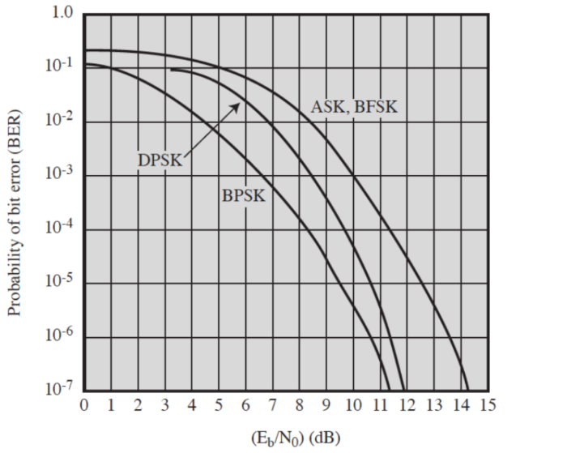
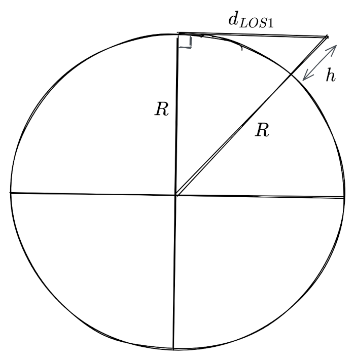
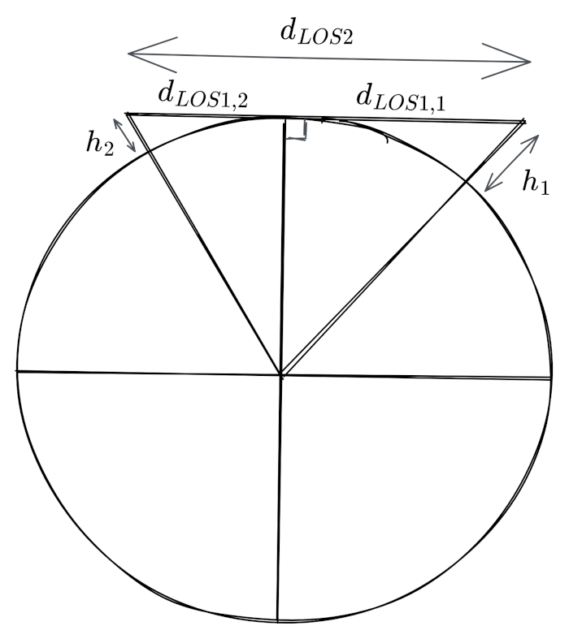

# Home Assignment 1 - PHY Layer

## Question 1 (2 points)

> What is the channel capacity for a channel with BW=300Hz and SNR=3dB ?

$SNR = 3dB = 2.00$

Shannon's capacity : $C = BW \cdot log_2(1 + SNR) = 475 bps$

## Question 2 (10 points)

> Assume a wireless communication system which operates at 9600 bps. Find the minimum required bandwidth of the wireless channel if a signal’s element encodes a 4-bit word. 

We have :

 - $C = 9600 bps$
 - $M = 2^4 = 16$

Nyquist capacity : $C = 2BW \cdot log_2(M)$

$$\implies BW = \frac{C}{2 \cdot log_2(M)} = 1200 Hz$$

## Question 3 (5 points)

> Given a channel with an intended capacity of 20Mbps, the bandwidth of the channel is 3MHz. What signal-to-noise ratio is required to achieve this capacity ?

We have :

 - $C = 20 \times 10^6 bps$
 - $BW = 3 \times 10^6 Hz$

Shannon's capacity : $C = BW \cdot log_2(1 + SNR)$

$$\implies SNR = 2^{C/BW} - 1 = 100.59 = 20.03 dB$$

## Question 4 (5 points)

> Assume that the required bit error rate is $10^{-6}$. What SNR ratio is required to achieve a bandwidth efficiency of 1.0 bit/s/Hz for ASK, FSK, PSK ?

Bandwith efficiency : $BWE = \frac{R}{BW} = 1.0 bit/s/Hz$

$\frac{E_b}{N_0} = \frac{S}{N} \times \frac{BW}{R} = \frac{SNR}{BWE} \implies SNR = BWE \times \frac{E_b}{N_0} = \frac{E_b}{N_0}$

For $E_b/N_0$, we will use the following graph, knowing that $BER = 10^{-6}$ :

{height=300px}

### ASK modulation technique

$SNR = \frac{E_b}{N_0} = 13.5 dB = 22.39$

### FSK modulation technique

$SNR = \frac{E_b}{N_0} = 13.5 dB = 22.39$

### PSK modulation technique

$SNR = \frac{E_b}{N_0} = 10.6 dB = 11.48$

## Question 5 (10 points)

> A sine wave is to be used for two different modulation schemes: a.) PSK and b.) QPSK. The duration of a signal element is $T_s = 10^{-5} s$. The receiver receives a signal in form $s(t)=0.005 \cdot sin(2\pi 10^6t+\theta)$ volts. The resistance of the receiving circuit is $r = 1 Ohm$ (use Root Mean Square voltage for calculating power of signal’s element). The measured noise power is $N = 2.5 \times 10^{-8} W$. Determine the $E_b/N_0$ (in dB) for each case.

Using RMS formula for sine waves (classic case), we get that $V_{RMS} = \frac{0.005}{\sqrt{2}}$, and hence the signal power is $S=\frac{{V_{RMS}}^2}{r} = \frac{(0.005)^2}{2} = 1.25 \times 10^{-5} W$.

We deduce the value of the signal-to-noise ratio : $SNR = S/N = 500 = 27 dB$.

We can then say that $E_b = S \times T_b$, where $T_b$ is the duration of a single bit of information. 

$N_0$ being the noise per Hertz, we get that $N_0 = \frac{N}{f_s} = N \times T_s$.

Hence, we get that :

$$
\frac{E_b}{N_0} = \frac{S \times T_b}{N \times T_s} = SNR \times \frac{T_b}{T_s}
$$

### a. PSK

Each signal element conveys one bit of information and has a duration of $T_s = 10^{-5} s$, hence the duration of a single bit is $T_b = T_s = 10^{-5} bps$.

Therefore, we get that $\frac{E_b}{N_0} = SNR \times \frac{T_b}{T_s} = 500 = 27 dB$

### b. QPSK

Each signal element conveys two bits of information and has a duration of $T_s = 10^{-5} s$, hence the duration of a single bit is $T_b = T_s / 2 = 5 \times 10^{-6} bps$.

Therefore, we get that $\frac{E_b}{N_0} = SNR \times \frac{T_b}{T_s} = 250 = 24 dB$

## Question 6 (10 points)

> Derive the Line Of Sight formula. Use the information that $k$ is the service range correction coefficient due to the refractive effects of the atmospheric layer, which under normal weather conditions is chosen to be 4/3.

Let $R = 6.3781 \times 10^6 m$ be the radius of the earth and $h$ be the height of the antenna in meters. We want to find the maximum distance $d$ (in km) that a wave can travel in a "straight line" from the top of an antenna in order to reach another point (typically another antenna).

### LOS 1

{height=300px}

First, the setup described in the diagram above is considered to be entirely in the void (there is no atmosphere around the planet).

In this configuration, we can use Pythagoras' theorem in the triangle to show that :

$$
(R + h)^2 = R^2 + (1000 \cdot d_{LOS1})^2 \implies R^2 + 2Rh + h^2 = R^2 + (1000 \cdot d_{LOS1}) \implies d_{LOS1} = \frac{\sqrt{2Rh + h^2}}{1000}
$$

Under the assumption that $h << R$ ($\implies h^2 << Rh$), we get that :

$$
d_{LOS1} \approx \frac{\sqrt{2Rh}}{1000} = \frac{\sqrt{2 \times 6.3781 \times 10^6}}{1000} \cdot \sqrt{h} \approx 3.57 \cdot \sqrt{h}
$$

Now, we apply the correcting factor $k$ to the height of the antenna. This accounts for the fact that the refraction of the electromagentic waves in the atmosphere actually allow them to travel longer distances, hence the antenna appears to be higher. This yields the following result :

$$
d_{LOS1} = 3.57 \cdot \sqrt{kh}
$$

### LOS 2

{height=300px}

With the previous result, this is now trivial. We see that we have two setups similar to the previous configuration, hence the line of sight distance between the two antennas is :

$$
\begin{aligned}
d_{LOS2} & = d_{LOS1,1} + d_{LOS1,2} \\
& = 3.57 \cdot \sqrt{kh_1} + 3.57 \cdot \sqrt{kh_2} \\
& = 3.57 \cdot \left(\sqrt{kh_1} + \sqrt{kh_2}\right)
\end{aligned}
$$

## Question 7 (10 points)

> A sending node A transmits with a power of 20dBm via its antenna, which has an amplifying gain of 5dBi. The antenna has the same sending and receiving gain. The cable between amplifier and antenna at this sender is however fairly long and decreases the signal of 1dB. The receiver is a device of the same type, construction and antenna. The environment is a furnitured corridor at LTU, which creates a somewhat troublesome situation regarding multipath fading. Especially because students move furnitures regularly, more or less continuously changing the environment for multipath fading. Pick a proper fade margin based on the understanding of that this is a difficult environment. The frequency used is 2.4GHz and the receiver needs at least -80dBm to detect the transmission with low enough error probability. What is the maximum distance for this system (expressed in tens of meters)? 
>
> *NOTE: make sure to show all steps of your calculations including assumptions with motivation.*

Link budget :

$$
P_{RX} = P_{TX} + G_{TX} - L_{TX} - L_{FS} - L_{M} + G_{RX} - L_{RX}
$$

We know that for this setup, for the maximum distance :

- $P_{TX} = 20 dBm$
- $P_{RX} = -80 dBm$
- $G_{TX} = G_{RX} = 5 dBi$
- $L_{TX} = L_{RX} = 1 dB$

Hence, the equation becomes : $L_{FS} = 108 - L_{M}$

According to information found [online](https://dot11ap.wordpress.com/cwna/radio-frequency-rf-technologies/system-operating-margin-som-fade-margin-and-link-budget/), is is common to use a fade margin of 5dB for indoor environments where "high multipath or high noise floor conditions exist". Since we are in that kind of conditions but the environment also changes continuously, we will take 10dB for extra safety. We will also add 5dB for extra losses that may occur. This leads to $L_{M} = 15dB$.

This gives us a free space loss value of $L_{FS} = 93 dB$.

Using the free space loss equation, with the distance $d$ in km and the frequency $f$ in MHz :

$$
\begin{aligned}
& L_{FS} = 20 \cdot log_{10}(d) + 20 \cdot log_{10}(f) + 32.45 \\
& \implies log_{10}(d) + log_{10}(f) = \frac{L_{FS} - 32.45}{20} = 3.03 \\
& \implies log_{10}(d) = 3.28 - log_{10}(f) \\
& \implies d = 10^{3.28 - log_{10}(f)} = 10^{3.28}/f = 0.444 km = 444 m
\end{aligned}
$$

We see that the distance obtained is very big, especially if we put it in perspective with the results obtained in Lab 1, with a phone that was emitting with a power of 20dBm. One could argue that the antenna of the phone is most likely not oriented, so it should have a lower gain, still the results obtained in this question seem too high. We should maybe have chosen a higher value for $L_{M}$.

## Question 8 (8 points)

> What is the relationship between a signal’s spectrum and its bandwidth ?

The bandwidth of a signal is defined as $BW = f_{max} - f_{min}$, where :

- $f_{max}$ is the highest frequency used by the signal
- $f_{min}$ is the lowest frequency used by the signal

*Note : by "frequency used by a signal", we mean a frequency for which the intensity in the singal's spectrum is non-zero in theory, or non-negligible in practice*

> Define channel capacity.

The capacity of a channel $C$ is the maximum rate (or speed) at which data can be effectively transmitted. In our case it is expressed in multiples of bits per second (bps, kbps, Mbps, ...).

> What is the measurement unit of a channel bandwidth ?

The bandwith of a channel is measured in Hertz.

> What is SNR ?

SNR is the Signal-to-Noise Ratio, literally the quotient of the power of the signal $S$ and the power of the noise $N$ (both in the same multiple of watts) :

$$SNR = \frac{S}{N}$$

Is can be used as a measurement of how strong the signal is compared to the ambient noise (the bigger the SNR, the stronger the signal compared to the noise).

As expressed in the equation above, the SNR is unitless, but it can also be found expressed in decibels :

$$SNR_{dB} = 10 \cdot log_{10}\left(\frac{S}{N}\right) = S_{dB} - N_{dB}$$

> According to Shannon’s capacity formula, which channel is affected more by noise – a channel with a narrower bandwidth or a channel with a wider bandwidth ? Why ?

According to Shannon's capacity formula : $C = BW \cdot log_2(1 + SNR)$

Consider two channels with the same capacity $C$. Suppose that we send a signal of strength $S$ on both channels, we then have : 

$$
C = BW_1 \cdot log_2(1 + S/N_1) = BW_2 \cdot log_2(1 + S/N_2)
$$

$$
\implies
	\begin{cases}
		BW_1 = \frac{C}{log_2(1 + S/N_1)} \\
		BW_2 = \frac{C}{log_2(1 + S/N_2)}
	\end{cases}
$$

Now we suppose that one of the channels has a wider bandwidth than the other :

$$
\begin{aligned}
BW_1 \gt BW_2 & \implies \frac{C}{log_2(1 + S/N_1)} \gt \frac{C}{log_2(1 + S/N_2)} \\
& \implies log_2(1 + S/N_1) \lt log_2(1 + S/N_2) \\
& \implies 1 + S/N_1 \lt 1 + S/N_2 \\
& \implies N_1 \gt N_2
\end{aligned}
$$

For the same capacity, the channel with the wider bandwidth can accept more noise, hence a channel with a narrower bandwidth is more affected by noise.

> What key factors affect channel capacity ?

According to Shannon's capacity formula : $C = BW \cdot log_2(1 + SNR)$

Hence, the channel capacity depends on :

- The bandwidth of the channel
- The Signal-to-Noise Ratio, and consequently :
	- The signal power
	- The noise power

> What are the major advantages of microwave transmission ?

- Microwaves have a higher frequency than radio waves, so they can transmit information faster. For example, they can be used to broadcast television, with rates around 400 Mbps.
- Microwaves have wavelenghts from $10^{-1}m$ to $10^{-3}m$, so it is easier to control how they diffract. As such, there exist antennas of various sizes that allow to form a beam of microwaves for point-to-point communication, which prevents interferences. 
- They can be used both for indoors short-distance communication or for long-range communication (such as satellite communication).

> What are the major disadvantages of microwave transmission ?

- Due to the wavelengths of microwaves, they don't diffract much in valleys like radio waves can do. They can't pass through objects very well either. Hence, it is required to have a direct line of sight.
- Some bands in the microwave spectrum are strongly attenuated by the earth's atmosphere, so they can't be used efficiently on long distances.
- Weather conditions such as rain, snow or thunderstorms can also attenuate the signal (rain fade, ...), be it for satellite or terrestrial communication.

