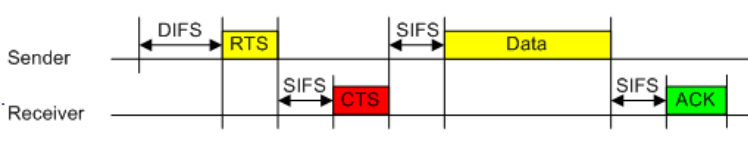
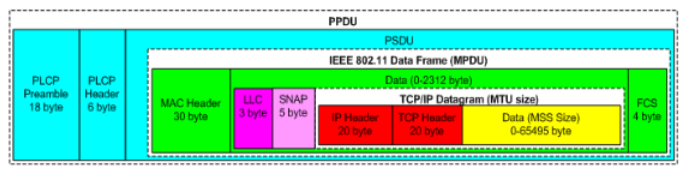
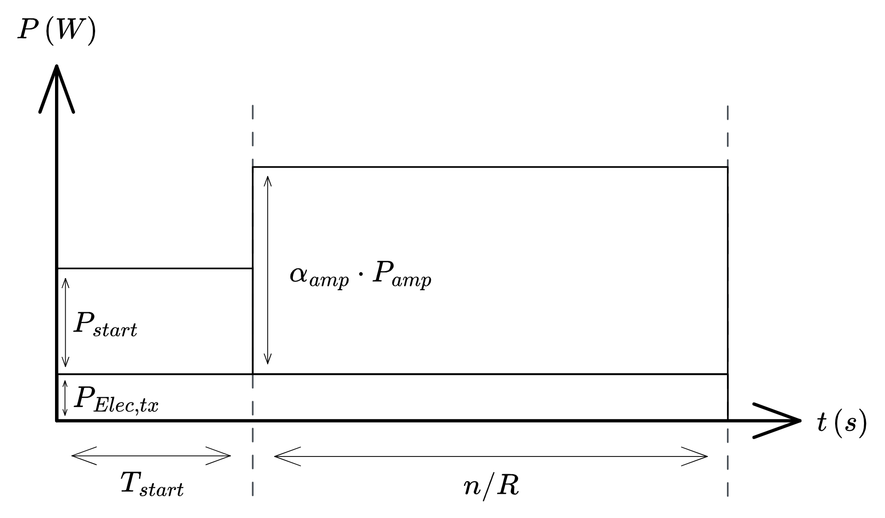
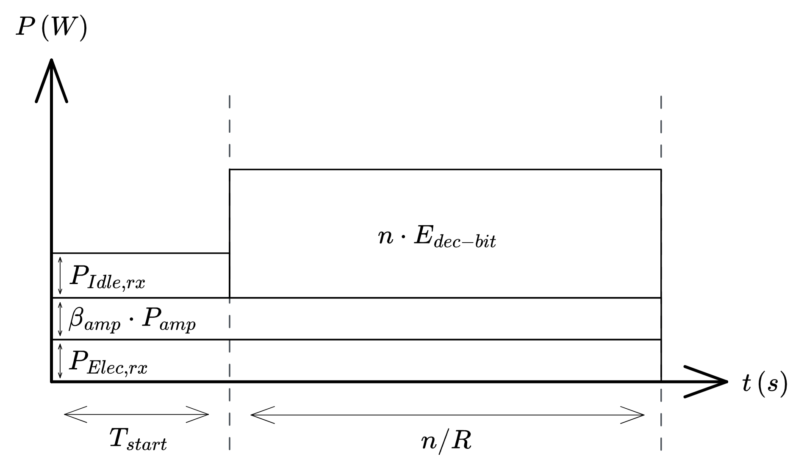
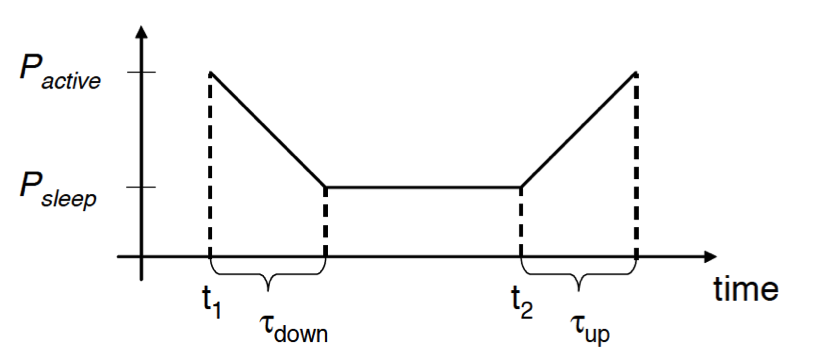

# Home Assignment 2 - WiFi & WSN

## Question 1 (10 points)

> Consider two nodes connected by an IEEE 802.11b 11 Mb/s wireless link. Assuming the wireless link is collision and error free, calculate the maximum application layer throughput over this wireless link, when UDP/IP is used. Use application layer payload sizes 272, 472 and 1472 bytes. Assume RTS/CTS and fragmentation are disabled on this link and do not consider any management frames besides MAC-ACKs. IEEE 802.11b protocol parameters are as follows:
>
> - PLCP preamble is 144 microseconds (144 bits over 1Mbps)
> - PLCP header is 48 microseconds
> - SIFS 10 microseconds
> - DIFS 50 microseconds
> - Slottime 20 microseconds
> - CWwin 31
> - MAC LLC header 24 bytes
> - MAC FCS (frame check sequence) is 4 bytes
> - ACK 14 bytes
> - IP header is 20 bytes
> - UDP header 8 bytes
>
> For simplicity reasons, only consider the long frame format.

Before transmitting data, the sender must wait for the time of the DIFS. Since there are only two nodes in our setup and only one is sendig data by hypothesis, the congestion window is never used. Hence, the time spent waiting before a transmission is :

$$
T_{before} = T_{DIFS} = 50 {\mu}s
$$

Likewise, at the end of the transmission the sender must wait for the time of the SIFS plus the time for the MAC-ACK to be transmitted (we are using UDP here, so there is no TCP ACK). Hence, the time spent waiting after a transmission is :

$$
T_{after} = T_{SIFS} + \frac{L_{ACK}}{R} = 20.18 {\mu}s
$$

The time for sending the data is equal to the time to send the application payload plus the time for sending the headers. It is a function of the payload size $S$ (in bits) :

$$
\begin{aligned}
T_{data}(S) & = T_{PLCP,pre} + T_{PLCP,head} + \frac{L_{MAC} + L_{LLC} + L_{SNAP} + L_{IP} + L_{UDP} + S + L_{FCS}}{R} \\
& = 192 + \frac{8 \times (30 + 3 + 5 + 20 + 8 + 4) + S}{11} \\
& = 192 + \frac{544 + S}{11}
\end{aligned}
$$

*Note: the sizes given in the subject are not the standard sizes for some headers, we will thus ignore them and use the standard sizes (see diagram in question 2)*

We can deduce the total time for sending the payload of size $S$ :

$$
T(S) = T_{before} + T_{data}(S) + T_{after} = 262 + \frac{544 + S}{11}
$$

And hence, the application throughput for payload size $S$ is :

$$
R_{app}(S) = S/T(S) = \frac{S}{262 + \frac{544 + S}{11}} = \frac{11 \cdot S}{3426 + S}
$$

We can then compute the application throughput for each payload size :

| Payload size (bytes) | Application throughput (Mbps) |
|---------------------:|------------------------------:|
|                  272 |                         4.273 |
|                  472 |                         5.767 |
|                 1472 |                         8.521 |

## Question 2 (10 points)

> Suppose an IEEE 802.11b compatible station is configured to always use virtual carrier sensing mechanisms (RTS/CTS). The station is about to transmit 1000 bytes of data and senses the channel as free. Calculate the time required to send the data frame and receive the acknowledgement as a function of SIFS and DIFS and ignoring the propagation delay.

We are in the following configuration :

Since the channel is sensed as free, there is no need to use the congestion window as part of CSMA/CA.

The total time to send the data and recieve the ACK is thus :

$$
T = T_{DIFS} + 3 \cdot T_{SIFS} + T_{RTS} + T_{CTS} + T_{data} + T_{ACK}
$$

We know the size of the control packets :

- $L_{RTS} = 20B = 160b$
- $L_{CTS} = 14B = 112b$
- $L_{ACK} = 14B = 112b$

Which gives us :

$$
\begin{aligned}
T & = T_{DIFS} + 3 \cdot T_{SIFS} + \frac{L_{RTS}}{R} + \frac{L_{CTS}}{R} + T_{data} + \frac{L_{ACK}}{R} \\
& = T_{DIFS} + 3 \cdot T_{SIFS} + \frac{384}{R} + T_{data}
\end{aligned}
$$

Where $R$ is the data rate on the WiFi link, in Mbps.

Then, in order to obtain the time required to send the data we need to look at the typical structure of the headers :

*Note: here we are using UDP instead of TCP, for wich the header size is 8B instead of 20B.*

This allows us to say that :

$$
T_{data} = T_{PLCP,pre} + T_{PLCP,head} + T_{MAC} + T_{LLC} + T_{SNAP} + T_{IP} + T_{UDP} + T_{payload} + T_{FCS}
$$

The PLCP preamble and header are always sent at a rate of 1Mbps, hence $T_{PLCP,pre} = 18 \times 8 / 1 = 144ms$ and $T_{PLCP,head} = 6 \times 8 / 1 = 48ms$.

The rest is sent at the transmission rate $R$, thus :

$$
\begin{aligned}
T_{data} & = 144 + 48 + \frac{L_{MAC} + L_{LLC} + L_{SNAP} + L_{IP} + L_{TCP} + L_{payload} + L_{FCS}}{R} \\
& = 192 + \frac{8 \times (30 + 3 + 5 + 20 + 6 + 1000 + 4)}{R} \\
& = 192 + \frac{8544}{R}
\end{aligned}
$$

And finally, the total time is :

$$
\boxed{T = T_{DIFS} + 3 \cdot T_{SIFS} + 192 + \frac{8928}{R}}
$$

## Question 3 (10 points)

> For a wireless sensor node express $E_{tx}$ – the energy spend for transmission and $E_{recv}$ – the energy spent for reception as functions of the parameters below, when 1000 bits are transmitted and successfully received.
> 
> | Parameter                     | Description                        |
> |:------------------------------|:-----------------------------------|
> | $\alpha_{amp}$, $\beta_{amp}$ | constants (amplifier architecture) |
> | $P_{amp}$                     | amplifier power                    |
> | $P_{rx,Elec}$, $P_{tx,Elec}$  | constant power for circuitry       |
> | $P_{rx,Idle}$                 | receiving power in idle state      |
> | $P_{start}$                   | constant power                     |
> | $T_{start}$                   | time to rise up                    |
> | $n$                           | number of bits                     |
> | $R$                           | data rate                          |
> | $E_{dec-bit}$                 | energy for decoding received bits  |

For the sender, first we have the start time and then the bits are transmitted with amplification. We consider that the power for the circuitry $P_{tx,Elec}$ has not been accounted for in the starting power $P_{start}$. This can be summarised as follows :

{height=250px}

Hence, the energy consumed by the sender is :

$$
\boxed{E_{tx} = T_{start} \cdot (P_{tx,Elec} + P_{start}) + \frac{n}{R} \times (P_{tx,Elec} + \alpha_{amp} \cdot P_{amp})}
$$

On the receiver end, the system is constantly consuming electricity for the circuitry and the amplifier, in order to be able to detect incoming communications. While the sender is starting, the receiver is in idle state, it then receives the bits and decodes them. This can be summarised as follows :

{height=250px}

Hence, the energy spent by the receiver is :

$$
E_{rx} = \left(T_{start} + \frac{n}{R} \right) \times (P_{rx,Elec} + \beta_{amp} \cdot P_{amp}) + T_{start} \cdot P_{rx,Idle} + n \cdot E_{dec-bit}
$$

Technically speaking, it could be argued that the reception of the data does not include the starting time of the sender, in which case :

$$
\boxed{E_{recv} = \frac{n}{R} \times (P_{rx,Elec} + \beta_{amp} \cdot P_{amp}) + n \cdot E_{dec-bit}}
$$

## Question 4 (10 points)

> A HW component of the a wireless sensor node operates in states such as idle, active, or sleep with different power consumptions. Transitions between states take power and time. But how long to be remain in a state is a trade-off between energy savings $E_{saved}$ and overhead $E_{overhead}$.
> 
> Assume that putting the controller from active to sleep takes $\tau_{down}$ at time $t_1$. Correspondingly, waking up when an event has occurred at time $t_2$ takes $\tau_{up}$. Derive the equations for $E_{saved}$ and $E_{overhead}$ and give a rule (inequality) when energy can be saved.

The energy can be defined as $E = \int{P(t) \,dt}$. Since we are in a rather simple case, we can resort to simply computing the area under the curve.

If the device is not put in sleep mode, the energy consumed between $t_1$ and $t_2$ is $E_{nosleep} = P_{active} \cdot (t_2 - t_1)$.

If there the device is put in sleep mode and waken up, the energy consumed during the same time period is :

$$
E_{sleep} = P_{sleep} \cdot (t_2 - t_1) + \frac{(P_{active} - P_{sleep}) \cdot \tau_{down}}{2}
$$

The energy saved by putting the device to sleep is therefore :

$$
\begin{aligned}
E_{saved} & = E_{nosleep} - E_{sleep} \\
& = P_{active} \cdot (t_2 - t_1) - P_{sleep} \cdot (t_2 - t_1) - \frac{(P_{active} - P_{sleep}) \cdot \tau_{down}}{2} \\
& = (P_{active} - P_{sleep}) \times \left(t_2 - t_1 - \frac{\tau_{down}}{2} \right)
\end{aligned}
$$

However, when we put the device to sleep we have an additional period of length $\tau_{up}$ during which it emerges from sleep. The energy consumed during that period is the overhead :

$$
\begin{aligned}
E_{overhead} & = P_{sleep} \cdot \tau_{up} + (P_{active} - P_{sleep}) \cdot \frac{\tau_{up}}{2} \\
& = (P_{active} + P_{sleep}) \cdot \frac{\tau_{up}}{2}
\end{aligned}
$$

In order for the sleep to be profitable, we want the energy saved to be greater than the overhead :

$$
\begin{aligned}
& E_{saved} \gt E_{overhead} \\
& \implies (P_{active} - P_{sleep}) \times \left(t_2 - t_1 - \frac{\tau_{down}}{2} \right) \gt (P_{active} + P_{sleep}) \cdot \frac{\tau_{up}}{2} \\
& \implies \boxed{\tau_{up} \lt \frac{P_{active} - P_{sleep}}{P_{active} + P_{sleep}} \times \left(2(t_2 - t_1) - \tau_{down}\right)}
\end{aligned}
$$

