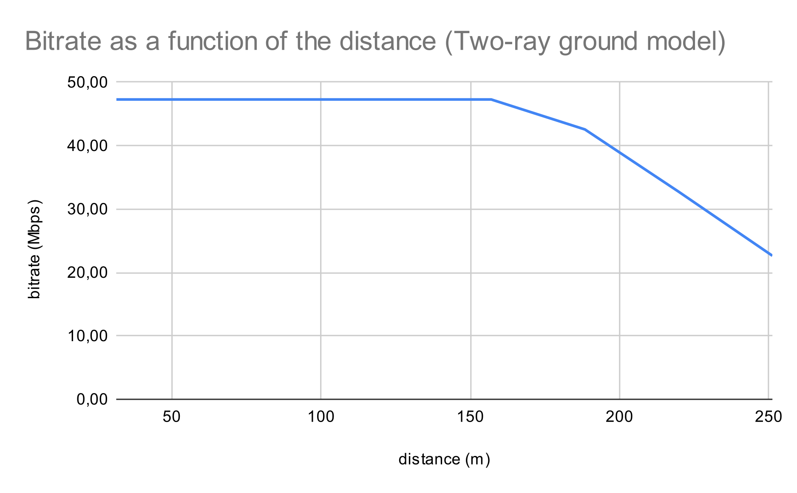
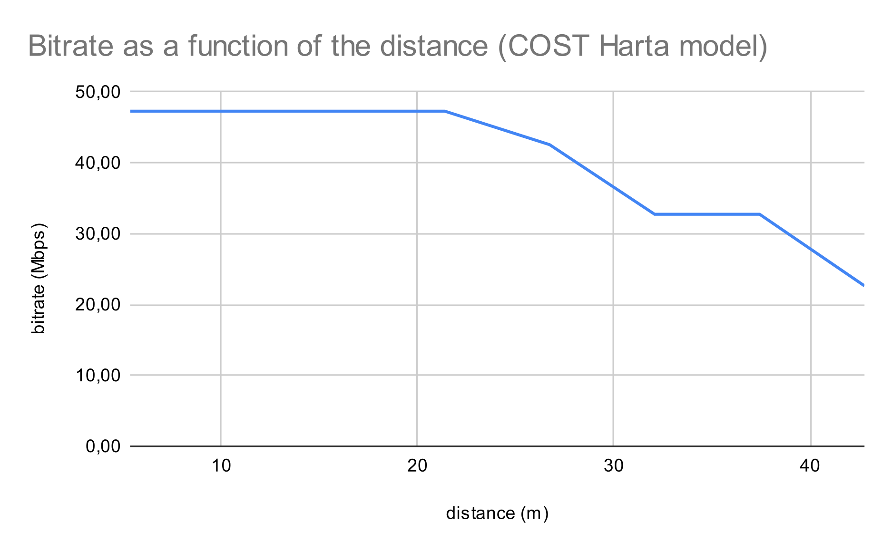
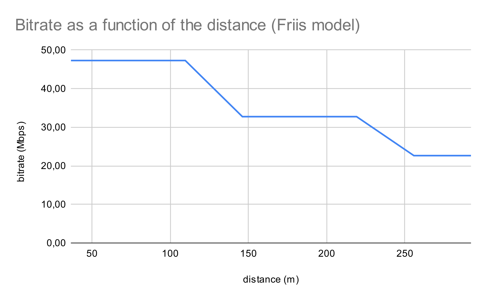
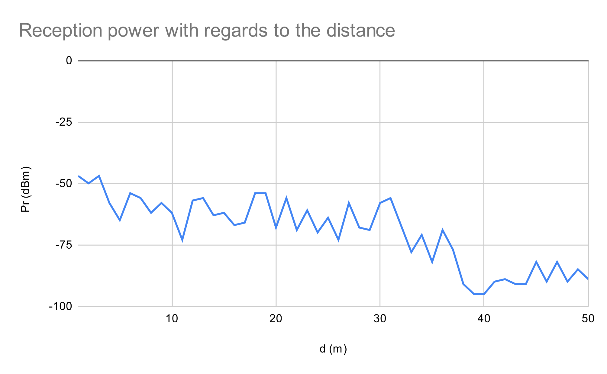
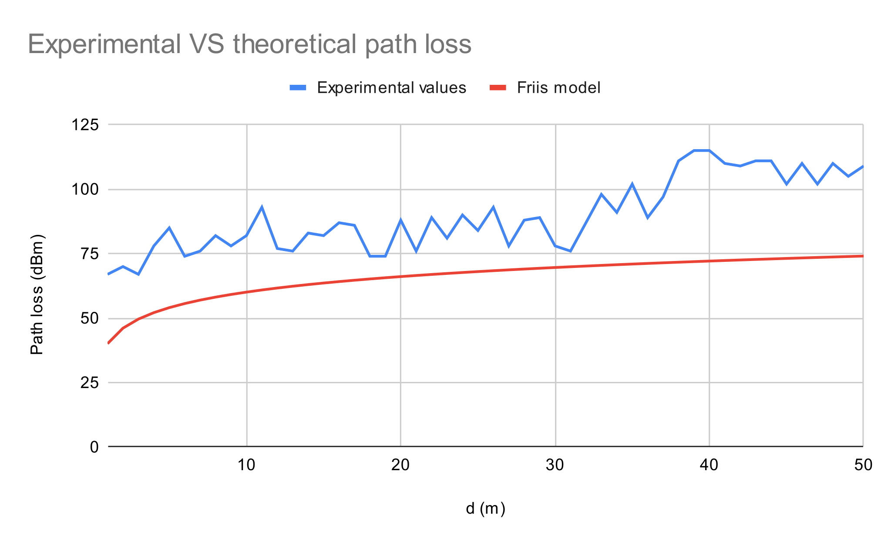

# Lab 1 - Measuring the influence of attenuation of radio signal on network performance for different radio propagation models

Nathan PERIER, Aldo COLOMBO

## Part 1

### Two-Ray Ground propagation loss model

We have the following formula :

$$P_r = \frac{P_t \cdot G_t \cdot G_r \cdot ({h_t}^2 \cdot {h_r}^2)}{d^4 \cdot L}$$

Where :

- $P_r$ is the reception power (W)
- $P_t$ is the transmission power (W)
- $G_r$ is the reception gain (unitless)
- $G_t$ is the transmission gain (unitless)
- $h_r$ is the height of the reciever relative to the ground (m)
- $h_t$ is the height of the transmitter relative to the ground (m)
- $d$ is the distance from the reciever to the transmitter (m)
- $L$ is a parameter added for consistency (unitless)

In our case :

- $P_r = S_r$, the sensitivity of the reciever (minimum power required to decode the signal)
- $L=1$ in accordance to [the documentation](https://www.nsnam.org/docs/release/3.34/doxygen/classns3_1_1_two_ray_ground_propagation_loss_model.html#details)

Hence, the equation becomes :

$$S_r = \frac{P_t \cdot G_t \cdot G_r \cdot ({h_t}^2 \cdot {h_r}^2)}{{d_i}^4} \implies d_i = \left(\frac{P_t \cdot G_t \cdot G_r \cdot ({h_t}^2 \cdot {h_r}^2)}{S_r}\right)^{1/4}$$

In the script, the parameters are set as follows :

- $S_r = -80 dBm = 10^{-8} mW$
- $P_t = 16 dBm = 10^{1.6} mW = 39.8 mW$
- $G_r = 0 dB = 1$
- $G_t = 0 dB = 1$
- $h_t = h_r = 1m$

It follows that $d_i = 251.17 m$.

By executing the ns-3 simulation for several distances and analysing the pcaps with Wireshark, we obtain the following values :

| Distance | d (m)  | bits sent | delay (ns) | Bitrate (Mbps) |
|----------|-------:|----------:|-----------:|---------------:|
| $d_i/8$  |  31.40 |      8512 |        180 |          47.29 |
| $2d_i/8$ |  62.79 |      8512 |        180 |          47.29 |
| $3d_i/8$ |  94.19 |      8512 |        180 |          47.29 |
| $4d_i/8$ | 125.59 |      8512 |        180 |          47.29 |
| $5d_i/8$ | 156.98 |      8512 |        180 |          47.29 |
| $6d_i/8$ | 188.38 |      8512 |        200 |          42.56 |
| $7d_i/8$ | 219.77 |      8512 |        260 |          32.74 |
| $d_i$    | 251.17 |      8512 |        376 |          22.64 |

These results are summarised in the following plot :

### COST Hata propagation loss model

We have the following formula :

$$L_b = 46.3 + 33.9 \cdot log_{10}(f) - 13.82 \cdot log_{10}(h_B) - a(h_R, f) + (44.9 - 6.55 \cdot log_{10}(h_B))log_{10}(d) + C_m$$

Where :

- $L_b$ is the median path loss (dBm)
- $f$ is the frequency of transmission (MHz)
- $h_B$ is the emitter antenna (or "base station antenna") effective height (m)
- $h_R$ is the reciever antenna (or "mobile station antenna") effective height (m)
- $d$ is the link distance (km)
- $a(h_R, f)$ is the mobile station antenna height correction factor, that depends on the environment (dBm)
- $C_m$ is a constant offset (dBm)

The path loss can be defined as $L_b = P_t - P_r$, where $P_t$ and $P_r$ are respectively the tranmission power and the reception power (both in dB).

In our case, $C_m = 10dB$ according to the subject. Hence, the equation becomes :

$$L_b = P_t - P_r = 56.3 + 33.9 \cdot log_{10}(f) - 13.82 \cdot log_{10}(h_B) - a(h_R, f) + (44.9 - 6.55 \cdot log_{10}(h_B))log_{10}(d)$$

In the script, the parameters are set as follows :

- $P_r = S_r = -80 dBm$
- $P_t = 16 dBm$

Additionnally, according to [the documentation](https://www.nsnam.org/docs/release/3.34/doxygen/classns3_1_1_cost231_propagation_loss_model.html#details) we have :

- $h_B = 50m$
- $h_R = 3m$
- $f = 2.3GHz = 2300MHz$ (although we would expect 2.4GHz since we are using WiFi)

For the $a$ function, we take :

$$a(h_R, f) = (1.1 \cdot log_{10}(f) - 0.7)h_R - (1.56 \cdot log_{10}(f) - 0.8)$$

Hence, we have :

$$
\begin{aligned}
P_t - P_r = & \space 56.3 + 33.9 \cdot log_{10}(f) - 13.82 \cdot log_{10}(h_B) - (1.1 \cdot log_{10}(f) - 0.7)h_R \\
& + (1.56 \cdot log_{10}(f) - 0.8) + (44.9 - 6.55 \cdot log_{10}(h_B))log_{10}(d)
\end{aligned}
$$

$$
\begin{aligned}
\implies (44.9 - 6.55 \cdot log_{10}(h_B))log_{10}(d) = & \space P_t - P_r - 55.5 - 33.9 \cdot log_{10}(f) \\
& + 13.82 \cdot log_{10}(h_B) + (1.1 \cdot log_{10}(f) \\
& - 0.7)h_R - 1.56 \cdot log_{10}(f)
\end{aligned}
$$

$$
\implies log_{10}(d) = \frac{P_t - P_r - 55.5 - 35.46 \cdot log_{10}(f) + 13.82 \cdot log_{10}(h_B) + (1.1 \cdot log_{10}(f) - 0.7)h_R}{44.9 - 6.55 \cdot log_{10}(h_B)}
$$

$$
\begin{aligned}
\implies d & = {10}^{\frac{P_t - P_r - 55.5 - 35.46 \cdot log_{10}(f) + 13.82 \cdot log_{10}(h_B) + (1.1 \cdot log_{10}(f) - 0.7)h_R}{10(44.9 - 6.55 \cdot log_{10}(h_B))}} \\
& = 4.276 \times 10^{-2} km \\
& = 42.76m
\end{aligned}
$$

By executing the ns-3 simulation for several distances and analysing the pcaps with Wireshark, we obtain the following values :

| Distance | d (m) | bits sent | delay (ns) | Bitrate (Mbps) |
|----------|------:|----------:|-----------:|---------------:|
| $d_i/8$  |  5.35 |      8512 |        180 |          47.29 |
| $2d_i/8$ | 10.69 |      8512 |        180 |          47.29 |
| $3d_i/8$ | 16.04 |      8512 |        180 |          47.29 |
| $4d_i/8$ | 21.38 |      8512 |        180 |          47.29 |
| $5d_i/8$ | 26.72 |      8512 |        200 |          42.56 |
| $6d_i/8$ | 32.07 |      8512 |        260 |          32.74 |
| $7d_i/8$ | 37.42 |      8512 |        260 |          32.74 |
| $d_i$    | 42.76 |      8512 |        376 |          22.64 |

These results are summarised in the following plot :

### Friis propagation loss model 

We have the following formula :

$$P_r = \frac{P_t \cdot G_t \cdot G_r \cdot \lambda^2}{(4 \pi d)^2 L}$$

Where :

- $P_r$ is the reception power (W)
- $P_t$ is the transmission power (W)
- $G_r$ is the reception gain (unitless)
- $G_t$ is the transmission gain (unitless)
- $\lambda$ is the wavelength (m)
- $d$ is the distance from the reciever to the transmitter (m)
- $L$ is the system loss (unitless)

In our case :

- $P_r = S_r$, the sensitivity of the reciever (minimum power required to decode the signal)
- We don't know $\lambda$, but we know the carrier frequency $f$, so we can use the equation $\lambda = \frac{C}{f}$ with $C = 299792458 m/s$

Hence, the equation becomes :

$$S_r = \frac{P_t \cdot G_t \cdot G_r \cdot (C/f)^2}{(4 \pi d_i)^2 L} \implies d_i = \frac{C}{4 \pi f} \cdot \sqrt{\frac{P_t \cdot G_t \cdot G_r}{S_r \cdot L}}$$

The following values are set in the script :

- $S_r = -80 dBm = 10^{-8} mW$
- $P_t = 16 dBm = 10^{1.6} mW = 39.8 mW$
- $G_r = 0 dB = 1$
- $G_t = 0 dB = 1$

And we have the following values set by default according to the [documentation](https://www.nsnam.org/docs/release/3.34/doxygen/classns3_1_1_friis_propagation_loss_model.html#details) :

- $f = 5.15 GHz$
- $L = 1$

We finally get that : $d_i = 292.2 m$

By executing the ns-3 simulation for several distances and analysing the pcaps with Wireshark, we obtain the following values :

| Distance | d (m) | bits sent | delay (ns) | Bitrate (Mbps) |
|----------|------:|----------:|-----------:|---------------:|
| $d_i/8$  |  36.5 |      8512 |        180 |          47.29 |
| $2d_i/8$ |  73.1 |      8512 |        180 |          47.29 |
| $3d_i/8$ | 109.6 |      8512 |        180 |          47.29 |
| $4d_i/8$ | 146.1 |      8512 |        260 |          32.74 |
| $5d_i/8$ | 182.6 |      8512 |        260 |          32.74 |
| $6d_i/8$ | 219.1 |      8512 |        260 |          32.74 |
| $7d_i/8$ | 255.7 |      8512 |        376 |          22.64 |
| $d_i$    | 292.2 |      8512 |        376 |          22.64 |

These results are summarised in the following plot :

## Part 2

For this experiment, we were unable to set up an ad-hoc WiFi network because of a bug in one of the laptop's networking configuration pannel. Instead, we set up a personal access point on a phone and connected a computer to that phone, constantly sending a ping to the phone. We then took 50 measurements as specified in the subject, using the `iw` command. These measurements are summarised in the following graph :

We can then compute the path loss $L_p = P_t - P_r$ for the expermental values and using Friis propagation loss model :

$$P_{r,ul} = \frac{P_{t,ul} \cdot G_t \cdot G_r \cdot \lambda^2}{(4 \pi d)^2 L} \implies L_p = P_{t,dBm} - 10 \cdot log_{10}\left(\frac{P_{t,ul} \cdot G_t \cdot G_r \cdot (C/f)^2}{(4 \pi d)^2 L}\right)$$

For the phone we used, we found the following values in the manual :

- $f = 2412 MHz$
- $P_t = 20 dBm = 100 mW$

Since we don't have some information, we will assume that :

- $G_t = G_r = 0 dBm = 1$
- $L = 1$

We then plot these values, which gives us the following graph :

We can see that the experimental curve follows roughly the same shape as the theoretical curve at the beginning, but the path loss is significantly higher. This may be due to the fact that :

- We picked arbitrary values for $G_t$, $G_r$ and $L$, which may actually not be representative of our setup.
- The model was made for an ideal setup, whereas the conditions of our experiment are much rougher (interferences, misalignment, ...). We can namely note that the model is intended for conditions in which there is no multipath propagation, which is obviously not the case in a corridor. This model would be better suited in the case of satellite communication for example, according to [this Wikipedia article](https://en.wikipedia.org/wiki/Friis_transmission_equation#Contemporary_formula).

We can also note that the experimental results vary a lot, which may be due to the non-ideal conditions expressed above. Notably, the RSSI value at one location can vary a lot during a small period of time. To account for this, we made averages over a set of measurements taken at the same spot, which hopefully helped reducing the variability of the measurement.

Finally, we can clearly see that from the {32}^{rd} experiment onwards we lose the line of sight with the phone, hence the path loss increases significantly. This is not the case with the theoretical model because once again it is not intended to be used in such conditions.
