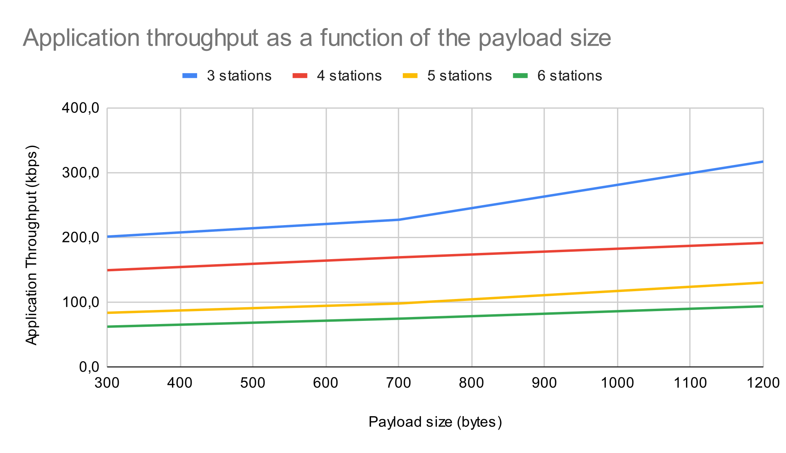
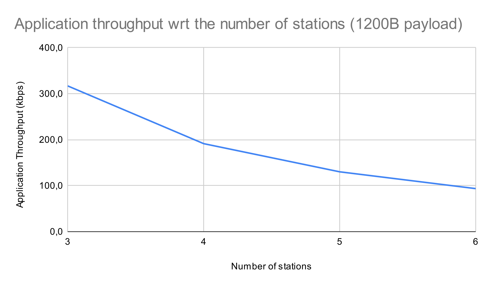
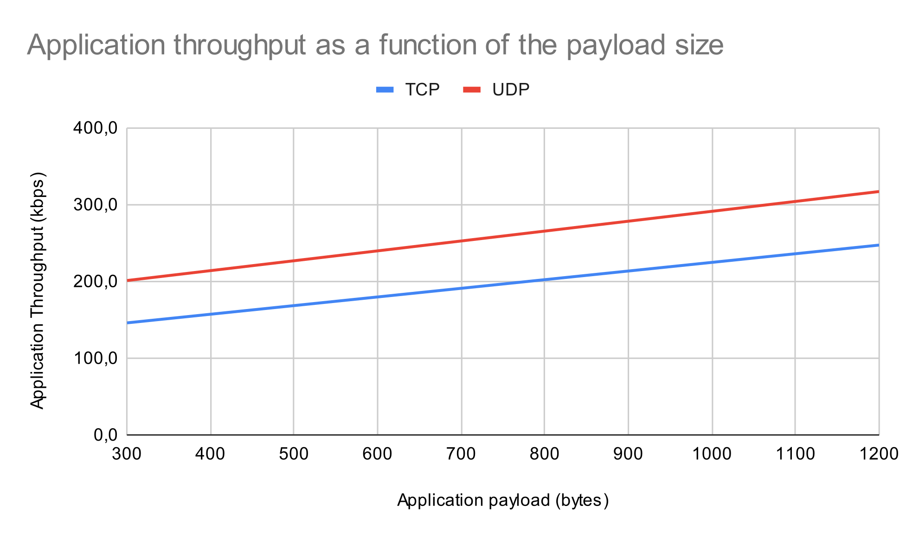

# Lab 3 - Measuring performance of an Ad Hoc network

Nathan PERIER, Aldo COLOMBO

## Part 1 - UDP

In this part, we make measurements of the application throughput in an ad hoc network. There is a certain number of nodes in a straight line, two consecutive nodes being distant of 200m. The first node in the chain generates 10Mbps UDP traffic at destination of the last node, that simply recieves all the packets. We want to study the behaviour for application payload of sizes 300B, 700B and 1200B. For each of these payload sizes, we make a simulation with 3, 4, 5 and 6 nodes in total.

First, we want to see the impact of payload size on throughput. With the simulation results, we plot the following graph :

We clearly see that the throughput increases with the payload size. This is because each datagram sent from one node to another requires one DIFS, one SIFS, one MAC ACK and potentially one congestion window. Each payload is also encapsulated in various headers, which increase transmission time at fixed rate. Sending more information per datagram helps reducing this overhead, so we can send less packets in the same amount but overall this amounts to more application data.

We can also see that the throughput decreases with the number of nodes, which is further explicited in the following graph :

This is a result we expected, since the overhead mentioned previously applies between each couple of nodes implicated in the transmission. Hence, more nodes introduce more overhead and there are less resources available for transmitting application data. Also, the intermediary nodes will have to switch from receiving packets from the sender node's side and transmitting them to the sender, which takes time.

The application throughput is much lower than the physical layer bitrate (1Mbps), which is logical since we have overhead for packet transmission and potential packet losses.

In theory, the largest packet size will be better because it will minimise overhead, so we should take a value that brings the UDP datagram to a size close from the MTU. We hould also take into account the fact that it might be better to use the RTS/CTS mechanism for large packets, as seen in the previous lab. For example, in the case studied before, we should take 1200B payloads.

## Part 2 - TCP

We now want to compare the use of UDP and TCP with the previously described setup. For this, we replace the UDP application and receiving socket by two TCP applications : one that acts as a sender and one that acts as a receiver. This time, we only make measurements with 3 nodes, for 300B and 1200B packets.

The following graph shows the results obtained with TCP compared with the previous UDP results :

We can see that the throughput we obtain with TCP is smaller than the throughput with UDP. This is because the receiver of the application data is now also sending packets to the sender (acknowledgements), which add even more overhead (SIFS, transmission time, MAC ACK). Unlike UDP, TCP guarantees that all the packets will arrive to the destination in the correct order, hence we have retransmissions of lost packets when a loss is detected or when packets arrive in the wrong order, which consume more resources.
