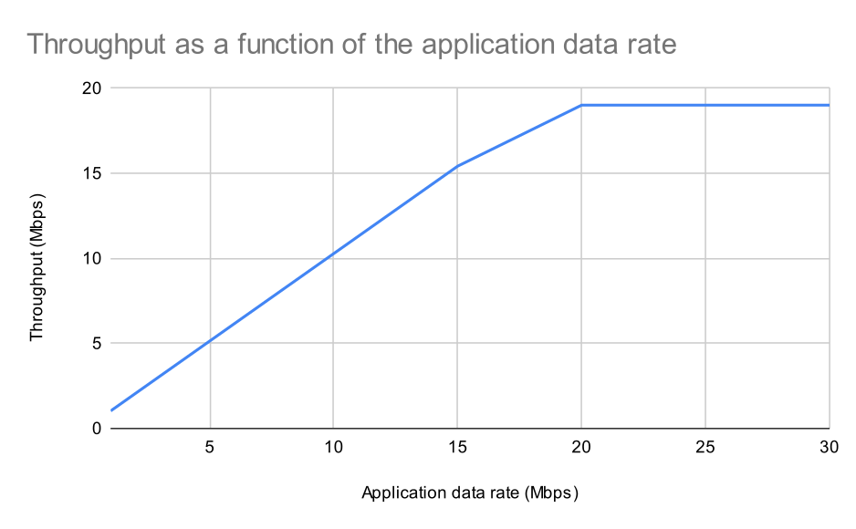
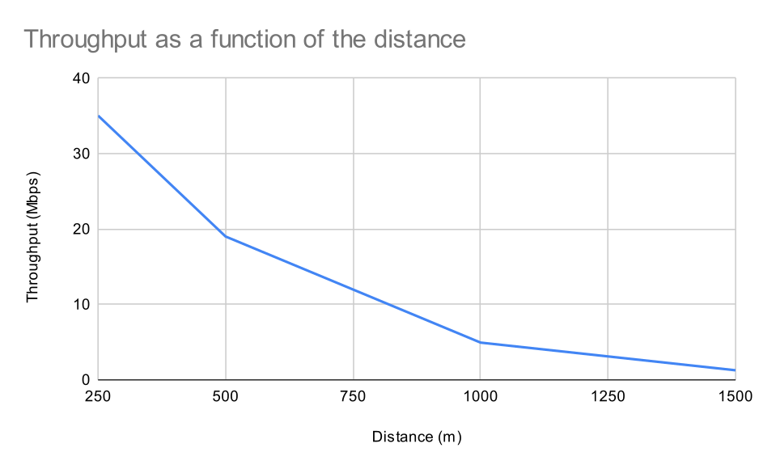

# Lab 4 - LTE module

Nathan PERIER, Aldo COLOMBO

## Antenna configurations

First, we set the distance to 500m, with the UE aligned with the antenna when the latter is directional. The packet size is set to 1024 bytes and the application data rate is set to 50 Mbps.

We vary the antenna type (isotropic, parabolic, cosine) and we compare the traces obtained. 

We first notice that the PCAP are always the same, which makes sense since the applications always send data of the same size and at the same rate, via UDP. We also see that the text traces are exactly the same, which is probably because we are aligned with the direction of the antenna when there is one.

Then, we put the UE at the same distance but this time on the axis perpendicular to that of the antennas. We notice that the results don't change for the isotropic antenna, which we expected since it isn't directional. However, the cosine antenna achieves much smaller results, and the parabolic antenna isn't able to transmit anything at all.

## File used for throughput calculation

PDCP is a protocol working [on top of RLC](https://en.wikipedia.org/wiki/Packet_Data_Convergence_Protocol). Since we want to get the throughput of the link, we want to take the highest protocol in the stack, in order to have more headers underneath and be closer to the actual quantity of data exchanged. Hence, we will use the PDCP files in the following experiments.

## Varying the data rate

We then set the distance to 500m and make simulations for several application data rates with the isotropic antenna. We get the following results :

We see that at first the throughput increases linearily with the data rate, and then it stabilises at a constant value, which is the maximum capacity of the channel.

## Varying the distance

Then, we set the data rate to 50 Mbps and we make simulations for several distances :

We can see that, as expected, the data rate decreases with the distance (and hence the signal strength).

